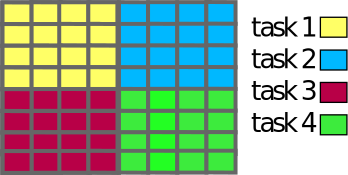
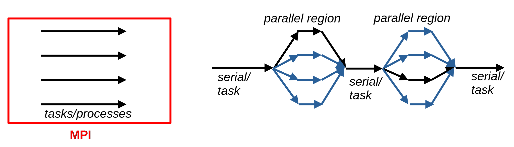

# Parallel computing {.section}

# Parallel computing

- Concept
	- Divide large problem into smaller subtasks performed simultaneously

- Structures in parallel computing


<br>

<div class=column>
<p style="text-align:center">Task parallelism</p>
{.center width=60%}
</div>
<div class=column>
<p style="text-align:center">Data parallelism</p>
{.center width=60%}
</div>


# Parallel computing

<div class=column>
- Real vs ideal scaling
	- Overhead: operations introduced by the parallel computing framework
	- Load imbalance: Uneven workload between processing units
</div>
<div class=column>
{.center width=80%}
</div>


- Weak vs strong scaling: Increased parallelism associated with increasing problem size vs faster execution


# Programming models {.section}

# Programming models

- Simultaneous execution of processes or threads on different CPU cores

	- Processes/tasks
		- Message passing interface (MPI)
	    - Distributed memory computing, multi-node platforms
		- Interaction based on explicit messages

	- Threads
		- OpenMP (+ others)
		- Interaction through shared memory
		- No direct access to threads running on another process and/or node


# Programming models

- Distributed vs shared memory computation
	- Processes vs Threads

{.center width=90%}


# Programming models

- Distributed vs shared memory computation
    - Processes vs Threads

{.center width=90%}


# MPI Premise

- Problem divided into multiple processes
- Each has its own memory space
- Explicit communication needed to share data between processes

{.center width=90%}


# MPI processes

- **Independent** execution of the same program code by multiple processes

- Each process has a unique *rank* ID  (0 ... N-1)

- Different ranks can work on different tasks and/or different data

<div class=column>
```fortran
IF (rank == 0) THEN
    CALL doProcedure1()
ELSE IF
    CALL doProcedure2()
...
```
</div>


<div class=column>
```fortran
IF (rank == 0) THEN
    a=1
ELSE IF (rank == 1) THEN
    a=2
ELSE IF ...
...
END IF
CALL doStuff(a)
...
```
</div>


# The MPI standard

- Different vendors implementing the standard
    - MPICH, openMPI, Cray ...
- Portability -- works on a variety of platforms

- Since 1994, latest version of the standard 4.1 (2023)


# The API 

- Communcation routines
- Execution control - synchronization
- Advanced features
	- User defined datatypes
	- Communication topologies; custom *communicators*


# Learning objectives
- Understand the concepts and key features of the API
	- MPI is extensive with hundreds of functions, but meaningful solutions can be built with a handful of tools
- Ability to write basic level MPI programs, understand most common use cases
- Know what to look for, know what to expect
- Encourage to explore further

# Things to come

{.center width=40%}
<p style="text-align:center">We're going to give You the keys to the Lamborghini</p>


# Things to come

{.center width=40%}
<p style="text-align:center">We're going to give You the keys to the Lamborghini</p>
<p style="text-align:center">...but you're going to have to drive it!</p>


# MPI programming {.section}

# Compiling and executing MPI programs

- MPI implementations ship with the API library + executables
	- Wrappers for compilers - mpicc, mpicxx, mpif90, mpifort ...
		- Include necessary options and links automatically

- In CSC environments ftn/cc/CC

- Launch: mpiexec, mpirun ...

```bash
mpirun -n 4 ./a.out
```

- Slurm: reservation or jobscript + srun
```bash
salloc -N 1 -p <partition> -A <account> --t 10
srun --ntasks=4 ./a.out
```


# First MPI program {.section}


# First MPI program

- MPI program always starts/finishes with **`MPI_Init`** / **`MPI_Finalize`**

<div class=column>
```fortran
PROGRAM keys2lamborghini
	USE mpi
	INTEGER :: err, rank, pes

	CALL MPI_Init(err)
	CALL MPI_Comm_size(MPI_COMM_WORLD,pes,err)
    CALL MPI_Comm_rank(MPI_COMM_WORLD,rank,err)
	CALL MPI_Finalize(err)

END PROGRAM keys2lamborghini
```
</div>
<div class=column>
<br>
<br>
<br>
Code executed by each process independently, unless including process-specific branching
</div>


# Presentation syntax {.split-definition}

- MPI calls are presented for the Fortran interface
    - Very similar in C

MPI_Function(`arg1`{.input}, `arg2`{.output})
  : `arg1`{.input}
    : Inputs given in red
  : `arg2`{.output}
    : Outputs given in blue


# **`MPI_Comm_size`** {.split-definition}

- Return the total number of processes

MPI_Comm_size(`comm`{.input}, `size`{.output}, `err`{.output})
  : integer `comm`{.input} 
	: Communicator
  : integer `size`{.output}
	: Number of processes in the communicator
  : integer `err`{.output}
	: Error status 


# **`MPI_Comm_rank`** {.split-definition}

- Return the rank id (integer) of the calling process

MPI_Comm_rank(`comm`{.input}, `rank`{.output}, `err`{.output})
  : integer `comm`{.input}
    : Communicator
  : integer `rank`{.output}
    : Rank of the calling process
  : integer `err`{.output}
    : Error status 

# MPI Communicator

- MPI communicator

    - An object connecting a group of processes
    - **MPI_COMM_WORLD** (includes all tasks in the invoked program)
    - Carry information about the number of processes and process ranks
    - Possible to define custom communicators for other purposes


# MPI communication {.section}

# Types of MPI communication

- Point-to-point communication
- Collective communication
- (One-sided communication)

<br>


- Blocking communication
    - Functions do not return until communication procedure is complete

- Non-blocking communication
    - Return immediately, communication in the background


# Point-to-point communication {.split-definition}

- Send and receive messages between two processes -- must have corresponding calls

MPI_Send(`buf`{.input},`count`{.input},`datatype`{.input},`dest`{.input},`tag`{.input},`comm`{.input},`err`{.output})
  : type(\*) `buf(..)`{.input}
    : Data send to another process
  : integer `count`{.input}
    : Number of elements in the data
  : integer `datatype`{.input}
    : Datatype of the elements in buf
  : integer `dest`{.input}
    : Rank of the receiving process
  : integer `tag`{.input}
    : An integer identifier for the msg
  : integer `comm`{.input}
    : Communicator
  : integer `err`{.output}
    : Error status


# Point-to-point communication {.split-definition}


MPI_Recv(`buf`{.input},`count`{.input},`datatype`{.input},`source`{.input},`tag`{.input},`comm`{.input},`status`{.output},`err`{.output})
  : type(\*) `buf(..)`{.output}
    : Data received from another process
  : integer `count`{.input}
    : Number of elements in the data
  : integer `datatype`{.input}
    : Datatype of the elements in buf
  : integer `source`{.input}
    : Rank of the source process
  : integer `tag`{.input}
    : An integer identifier for the msg
  : integer `comm`{.input}
    : Communicator
  : integer `status(MPI_STATUS_SIZE)`{.output}
    : Information about the received msg
  : integer `err`{.output}
    : Error status


# Point-to-point communication

```fortran
    CALL MPI_Init(err)
    ...
   
    CALL MPI_SEND(mydata,msize,MPI_INTEGER,dest,  &
                  tag_snd,MPI_COMM_WORLD,err)
    CALL MPI_RECV(otherdata,msize,MPI_INTEGER,src, &
                  tag_rcv,MPI_COMM_WORLD,st,err)
    ...

    CALL MPI_FINALIZE(err)

```

# MPI communications: Other considerations

- `Buffers` should be continuous blocks in memory 

- Deadlocks
    - The order of `MPI_Send` and `MPI_Recv` calls can be critical

    - Processes expecting `MPI_Recv`, while there is a missmatch with `MPI_Send`s &rarr; execution gets stuck


# Combined send/recv 

**MPI_Sendrecv(`sendbuf`{.input},`sendcount`{.input},`sendtype`{.input},`dest`{.input},`sendtag`{.input},`recvbuf`{.input},
`recvcount`{.input},`recvtype`{.input},`source`{.input},`recvtag`{.input},`comm`{.input},`status`{.output},`err`{.output})**

- Simultaneous send/recv &rarr; reduce risk for deadlocks

- Destination and source ranks can be the same or different


# Summary

- MPI provides a standard for parallel computing in distributed memory platforms

- Independent execution of the program code by each MPI process

- MPI processes held by a *communicator* object

- Explicit send/receive calls to exchange data between specific processes


