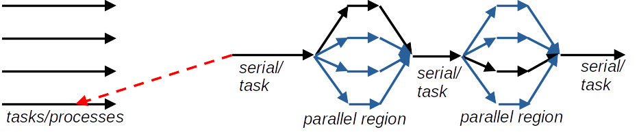

# Tasks {.section}

# Tasks

- Make dynamic work patterns parallel
    - while-loops (length not known beforehand)
    - recursion

- Explicit tasks vs implicitly created tasks for work constructs -- similar thing

# Tasks

- **`task`** construct
    - Create tasks &rarr; add to task queue &rarr; each task executed once by a single (arbitrary) thread

- Create by one thread (using e.g. **`master`** or **`single`**) or several threads

- Tasks are synced at implicit or explicit barriers
    - End of parallel region, explicit **`omp taskwait`**

- Tasks can create more tasks, e.g. in recursive functions

# Tasks

Will the outputs differ (with/without single)?

<div class=column>
```fortran
!$omp parallel
!$omp single
!$omp task
    WRITE(*,*) "FOO 0"
!$omp end task
!$omp task
    WRITE(*,*) "FOO 1"
!$omp end task
!$omp task
    WRITE(*,*) "FOO 2"
!$omp end task
!$omp task
    WRITE(*,*) "FOO 3"
!$omp end task
!$omp end single
!$omp end parallel
```
</div>

<div class=column>
```fortran
!$omp parallel

!$omp task
    WRITE(*,*) "FOO 0"
!$omp end task
!$omp task
    WRITE(*,*) "FOO 1"
!$omp end task
!$omp task
    WRITE(*,*) "FOO 2"
!$omp end task
!$omp task
    WRITE(*,*) "FOO 3"
!$omp end task

!$omp end parallel
```

</div>

# Tasks

<div class=column style=width:30%">

```bash
export OMP_NUM_THREADS=4
./a.out
```
```bash
 FOO 0
 FOO 3
 FOO 2
 FOO 1
```
</div>

<div class=column style="width:45%">

```bash
 FOO 0
 FOO 1
 FOO 2
 FOO 3
 FOO 0
 FOO 2
 FOO 3
 FOO 1
 FOO 0
 FOO 2
 FOO 3
 FOO 1
 FOO 3
 FOO 0
 FOO 2
 FOO 1
```

</div>


# Tasks

- Typical pattern to use one thread to create while others execute tasks from the queue

<div class=column>
```fortran
!$omp parallel private(i)
!$omp single
i = 0
DO WHILE (i < 10)
    !$omp task
        CALL doStuff()
    !$omp end task
    i = i + 1
END DO
!$omp end single
!$omp end parallel
```
</div>

<div class=column>
- Creates 10 tasks
- What about without **`omp single`** and with **`OMP_NUM_THREADS=4`**?

</div>


# Hybrid MPI - OpenMP programming {.section}


# Hybrid MPI - OpenMP programming

{.center width=70%}

- Two levels of parallelism: distributed memory in combination with shared memory
- Each MPI task can be divided into multiple threads
- Threads share the memory space within a MPI process


# Hybrid MPI - OpenMP programming

- Possible to improve scalability

- Hybrid model readily used in most modern codes

- Need to find the right balance between the number of processes per node and the number of threads per process

# Hybrid MPI - OpenMP programming

| Pros                             | Cons                                                                                      |
|---------------------------------------------------------------|--------------------------------------------------------------|
| Makes sense for modern platforms                              | Increase the degrees of freedom for optimal performance      |
| Take advantage of shared memory access vs. explicit messaging | Increased complexity of the code                             |
| Potential performance gains                                   | Implementation in large applications requires good planning  |


# Thread safe initialization {.split-definition}

MPI_Init_thread(`required`{.input}, `provided`{.output}, `err`{.output})
  : integer `required`{.input}
    : Required thread safety level
  : integer `provided`{.output}
    : Supported thread safety level

<br>

- **`required`{.input}** (and **`supported`{.output}**) will be one of pre-defined integer constants describing thread support level: <br> <br>
  **`MPI_THREAD_SINGLE`** < **`MPI_THREAD_FUNNELED`** < **`MPI_THREAD_SERIALIZED`** < **`MPI_THREAD_MULTIPLE`**


# MPI thread support level

|                      |                                             |
|----------------------|---------------------------------------------|
|MPI_THREAD_SINGLE     | One thread per process                      |
|MPI_THREAD_FUNNELED   | Multithreading, but MPI only on main thread |
|MPI_THREAD_SERIALIZED | MPI from all threads, one at a time         |
|MPI_THREAD_MULTIPLE   | No restrictions                             |


# MPI thread support levels

- Modern MPI libraries support all threading levels
    - OpenMPI: Build time configuration, check with
    ```bash
    ompi_info | grep 'Thread support'
    ```
    - Intel MPI: When compiling with `-qopenmp` a thread safe version of the
      MPI library is automatically used
    - Cray MPI: Set **`MPICH_MAX_THREAD_SAFETY`** environment variable to
      `single`, `funneled`, `serialized`, or `multiple` to select the
      threading level
- Note that using **`MPI_THREAD_MULTIPLE`** requires the MPI library to
  internally lock some data structures to avoid race conditions
    - may result in additional overhead in MPI calls


# Hybrid programming styles: fine/coarse grained

- Fine-grained
    - use **omp parallel do** on the most intensive loops
    - possible to hybridize an existing MPI code with little effort and in
      parts

- Coarse-grained
    - use OpenMP threads to replace MPI tasks
    - whole (or most of) program within the same parallel region
    - more likely to scale over the whole node, enables all cores to
      communicate (if supported by MPI implementation)


# Communication with multiple threads

- With support level **`MPI_THREAD_MULTIPLE`** all threads can make MPI calls
    - Communication can be guided by tags based on thread ID
    - Collective communication by multiple threads possible, but requires diligence
- MPI calls by a single thread (**`MPI_THREAD_FUNNELED`**,**`MPI_THREAD_SERIALIZED`**) keeps things simple and makes hybrid programming straight-forward


# First hybrid MPI-OpenMP program

```fortran
PROGRAM hello
USE mpi
USE omp_lib
IMPLICIT NONE
INTEGER :: required = MPI_THREAD_FUNNELED
INTEGER :: provided, err, myid,thid

CALL MPI_Init_thread(required,provided,err)
CALL MPI_Comm_rank(MPI_COMM_WORLD,myid,err)

!$omp parallel private(thid)
    thid = omp_get_thread_num()
    WRITE(*,*) "Process ", myid, " thread ", thid
!$omp end parallel

CALL MPI_Finalize(err)
END PROGRAM hello
``` 

# Summary

- Task constructs enable parallelization of dynamic work patterns, e.g. DO WHILE

- OpenMP may be utilized in distributed memory platforms in a hybrid programming model together with MPI

- With hybrid OpenMP - MPI each process associated with several CPU cores for multithreaded parallel regions

- Recommended to use a single thread for MPI communications, even though MPI between all threads is possible


