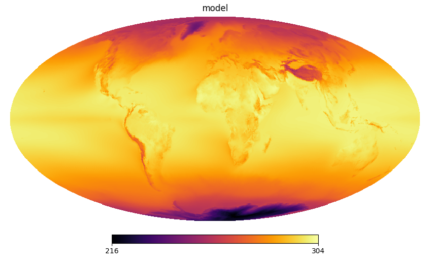
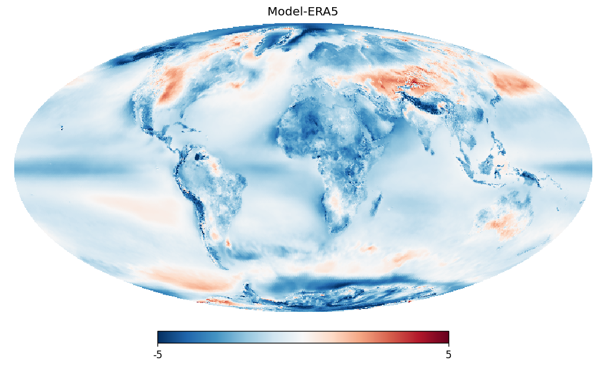
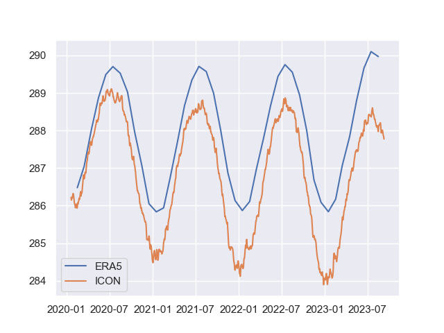

#

All models are wrong, but some are useful.

George Box, 1976

# What is our model good at?

* We want to use the model to learn about the climate system.
* We might want to learn about the future, where there are no observations.
* We might want to learn about the past, where observations are scarce.
* Where can we trust the model / where rather not?

# The difficulty of comparing to reality
* There is substantial climate variability, even on longer time scales.
* We don't know for which quantity our reality is on which end of the variability spectrum.
* We don't know for which quantity our simulation is on which end of the variability spectrum.
* We call the path of a simulation through the space of possible weathers the **trajectory**.

# The free-running model
* We don't expect the model to get the weather right, but the climate, i.e. the **statistics** of the weather.
* We can't directly compare to weather observations.
* Climate is changing fast.

What should we do?

# The free-running model
* We don't expect the model to get the weather right, but the climate, i.e. the **statistics** of the weather.
* We can't directly compare to weather observations.
* Climate is changing fast.
* We can verify conservation laws, etc.
* We can analyze the behavior.
* We can compare statistics to observations.
* We can compare statistics to those of other models.

# Topics of this talk

* Analyzing the model itself.
* Direct comparison to reanalysis
* Comparisons in ensembles

# Verifying conservation laws

# Verifying conservation laws
* Conservation of mass
  * Precipitation - evaporation
  * Ocean water and salt
* Conservation of energy
  * TOA radiation imbalance vs imbalance at surface
  * Ocean energy balance
  * Regional budgets are possible but messy regarding advection.
  
# Checking conservation in timeseries plots
[nextgems prefinal ICON](https://swift.dkrz.de/v1/dkrz_b381d76e-63d7-4aeb-96f0-dfd91e102d40/nextgems_prefinal/ngc4008/index.html)


# Analyzing model behavior from animations

Funky features in the model
[ ICON sea ice dynamics bug , see ngc4008_mov_np_conc.mp4](https://owncloud.gwdg.de/index.php/s/jg6fusRH9FO2ojO#/files_mediaviewer/ngc4008_mov_np_conc.mp4)

# Finding strong drift in components in time series plots

[ ICON test run cooling ](https://swift.dkrz.de/v1/dkrz_34406075a1684be9b56a2669a90730f2/nextgems-tmx-tuning/ngc3-tmx001/ngc3-tmx001_atm_mon.html)


# What can we compare to?

# What can we compare to?
* Individual measurements (difficult, c.f. statistics)
* Satellite data (same issue)
* Reanalyses
* Other models and other runs with the same model (but what is *correct*?)


# Comparing to reanalysis

Let's load some model and ERA5 data

```
import intake
import healpy as hp
import matplotlib.pyplot as plt
from easygems.healpix import attach_coords

hera_cat = intake.open_catalog("https://tcodata.mpimet.mpg.de/internal.yaml")
hera = hera_cat.HERA5.to_dask().pipe(attach_coords)
# Contains modified Copernicus Climate Change Service information 2023. 
# Neither the European Commission nor ECMWF is responsible for any use 
# that may be made of the Copernicus information or data it contains.
# This dataset is on healpix level 7

zoom = 7 
cat = intake.open_catalog("https://data.nextgems-h2020.eu/online.yaml")
icon = cat.ICON.ngc3028(zoom=zoom).to_dask().pipe(attach_coords)

```

# Select the same time slice

```
timeslice = slice("2020-02-01", "2023-01-31")
t_mean_model = icon.sel(time=timeslice).tas.mean(dim="time")
t_mean_obs = hera.sel(time=timeslice)["2t"].mean(dim="time") 
```

# A side-by-side plot

```
params = dict(flip='geo', nest=True, cmap='inferno', min=216, max=304)
hp.mollview(t_mean_model, **params)
plt.title("model")
plt.savefig("images/model_tas.png")
hp.mollview(t_mean_obs, **params)
plt.title("ERA5")
plt.savefig("images/era_tas.png")
```

{width=40%} {width=40%}


# Taking the difference

```
params_diff = dict(cmap="RdBu_r", min=-5, max=5, flip="geo", nest=True)
hp.mollview(t_mean_model-t_mean_obs, **params_diff)
plt.title("Model-ERA5")
```


# Is there a trend?

Get global mean temperature time series
```
icon_tas_ts=cat.ICON.ngc3028.to_dask().tas.mean(dim='cell')
timeslice = slice(icon_tas_ts.time[0],icon_tas_ts.time[-1])
hera_tas_ts=hera['2t'].sel(time=timeslice).mean(dim='cell')
```
# Is there a trend?
And plot them
```
import seaborn as sns
sns.set_theme()
plt.plot(hera_tas_ts.time, hera_tas_ts, label="ERA5")
plt.plot(icon_tas_ts.time, icon_tas_ts, label="ICON")
plt.legend()
```



