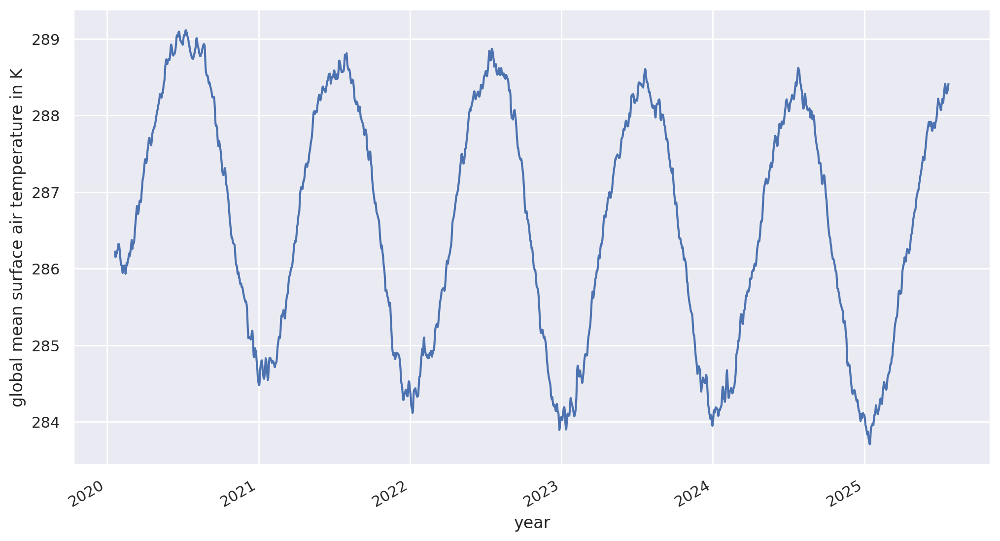
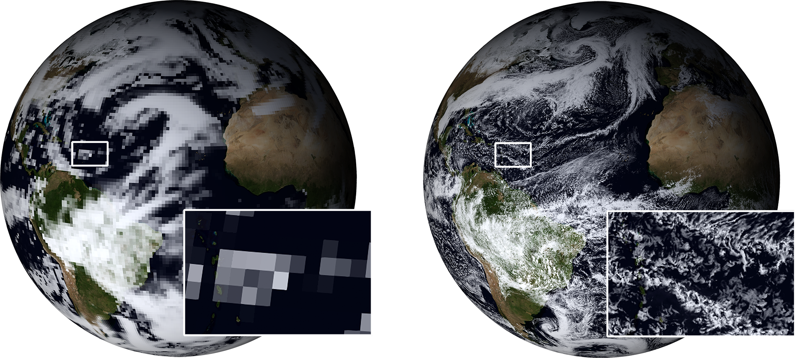
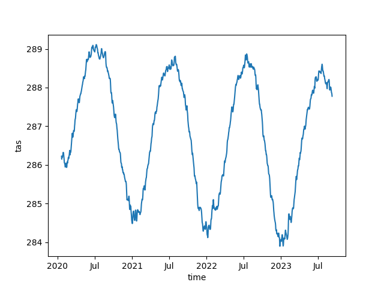
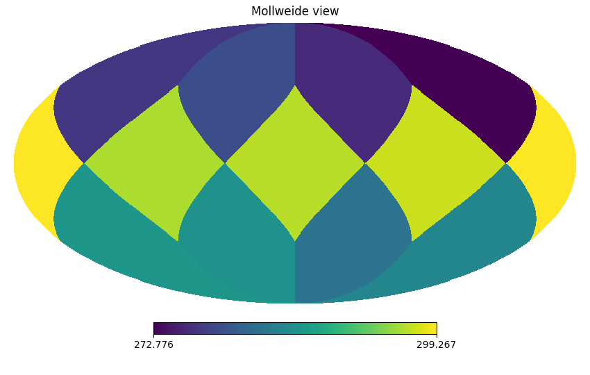
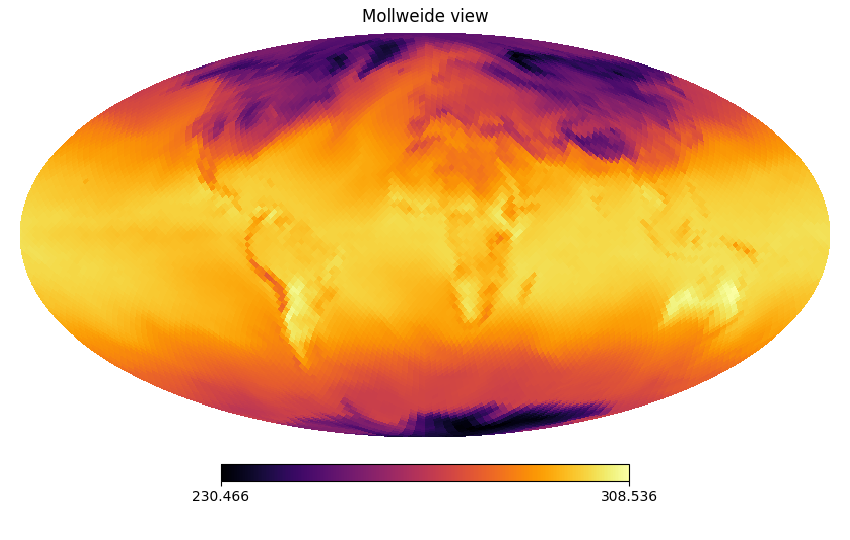
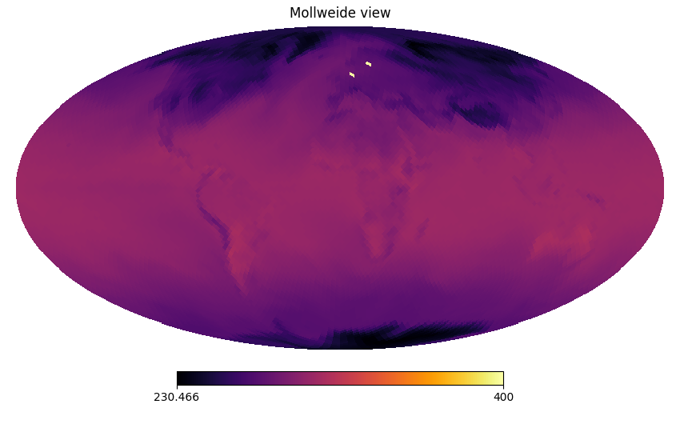
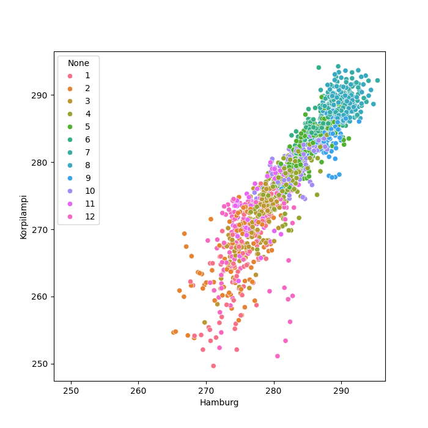
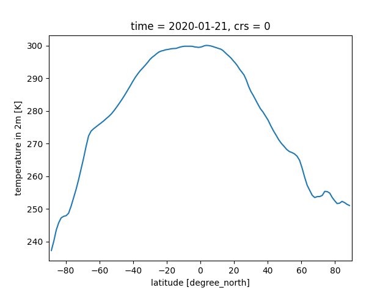
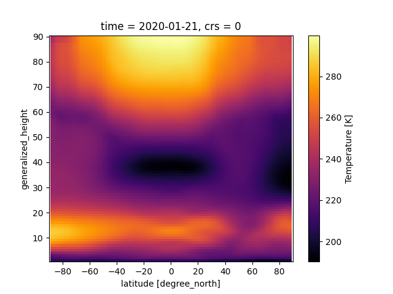
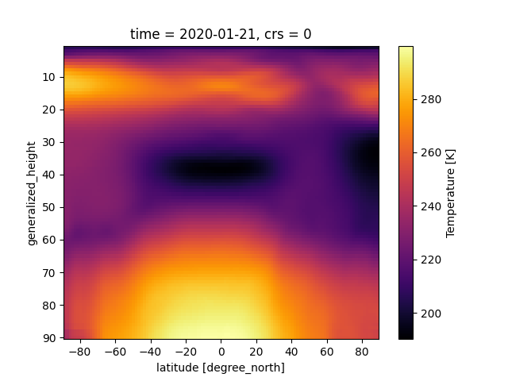

# Topics today

# What is visualization?
```
    4.779021e-07, 3.000158e-07, 3.943782e-07, 3.010814e-07, 1.824086e-07,
    5.077264e-08, 5.310072e-08, 5.276124e-08, 5.363153e-08, 1.070061e-07,
    6.913928e-08, 1.810711e-07, 9.877869e-08, 1.623726e-08, 4.198973e-08,
    1.642887e-08, 3.282246e-08, 9.109718e-08, 8.140145e-08, 7.397978e-08,
    8.817849e-08, 1.663861e-08, 2.876317e-08, 1.479019e-08, 9.942031e-09,
    2.125612e-08, 1.641772e-08, 2.962805e-08, 2.954731e-08, 3.859089e-08,
    4.320259e-08, 5.651723e-08, 2.374017e-08, 9.255361e-09, 8.066888e-09,
    1.965597e-08, 1.462259e-08, 2.813349e-07, 3.110567e-07, 2.363449e-07,
    2.999532e-07, 2.32825e-07, 2.798415e-07, 2.318629e-07, 2.352825e-07,
    2.309811e-07, 2.338195e-07, 2.171457e-07, 2.598324e-07, 4.017004e-07,
    3.878018e-07, 2.892292e-07, 3.617872e-07, 2.421747e-07, 1.556238e-07,
```

# What is visualization?

{width=90%} 

# What is visualization?
{width=100%}


# What are we looking at

* 3D, time varying atmosphere and ocean with many physical / biological properties
* 2D Screen / paper

# Challenges

* Data reduction
* Projection of the sphere onto a flat surface

# Common types of climate visualizations

* Maps
* Sections
* Line plots / scatter plots / ...

# The problem of the peeled orange

* There is no way to simply flatten out a sphere.
* Any projection will distort something.

# Common projections

* Form groups and describe the following projections
  * Plate Carree
  * Mercator
  * Mollweide
  * Robinson
  * Polar stereographic
  
* How are they constructed (if easy), what are they good at? What do they sacrifice?

See [xkcd](https://xkcd.com/977/) for an overview of more projections.

# The issue of too much data

* About 100 variables in a model output dataset
* A 2.5 km resolution simulation has about 80 Mio grid cells per layer.
* Things evolve over time - how do you look at 100 years of simulation?

# Image and data resolution

* One standard plot is about 1000x500 pixels
* 5 km output is 20 000 000 pixels
* Need about 2.5% of the data for a global map
* Dataset hierarchies with decreasing resolutions minimize time to plot.

# Rules of thumb
* First process, then plot (and cache processing results if possible).
* Reduce data as early as possible, but keep non-linearities in mind.

# What are key variables you would look at? At what frequency / averaging?

# Loading your data in python

* We will use jupyterhub.dkrz.de for interactive python plotting.
* We need a couple extra packages. You can simply install them with
`%pip install PACKAGENAME` in a jupyter notebook.

# Loading data with xarray and intake catalogs

A minimal version of the global mean surface air temperature plot.

```
import intake
cat = intake.open_catalog("https://data.nextgems-h2020.eu/online.yaml")
cat.ICON.ngc3028.to_dask().tas.mean(dim="cell").plot()
```

{width=30%}


# A minimal map plot

```
import intake
import healpy as hp

cat = intake.open_catalog("https://data.nextgems-h2020.eu/online.yaml")
hp.mollview(cat.ICON.ngc3028.to_dask().tas.isel(time=0), flip='geo', nest=True)
```

{width=40%}

This is a bit coarse. Let's go finer and switch the colormap

# A nicer map plot

```
import intake
import healpy as hp
import matplotlib.pyplot as plt
cat = intake.open_catalog("https://data.nextgems-h2020.eu/online.yaml")
hp.mollview(cat.ICON.ngc3028(zoom=5).to_dask().tas.isel(time=0), flip='geo', nest=True, cmap='inferno')

```

{width=40%}

Much better. :)

# Essential Python Libraries for Data Visualization

* [intake](https://intake.readthedocs.io/en/latest/) and [xarray](https://docs.xarray.dev/en/stable/) - loading data
* [numpy](https://numpy.org/doc/stable/) - efficient number crunching
* [pandas](https://pandas.pydata.org/docs/) - working with tables
* [matplotlib](https://matplotlib.org/) & [cartopy](https://scitools.org.uk/cartopy/docs/latest/) - basic plots
* [seaborn](https://seaborn.pydata.org/) - nicer visualizations
* [dask](https://docs.dask.org/en/latest/) - last resort if you need parallelization


# Line plots and friends

Have a look at [seaborn](https://seaborn.pydata.org/), and improve the time series plot.

# Digging deeper

Let's plot the temperatures for Hamburg and Korpilampi. First thing we need is to find the places in the data array. Here, the `healpy` package comes in handy.

```
? hp.ang2pix

Signature:  hp.ang2pix(nside, theta, phi, nest=False, lonlat=False)
Docstring:
ang2pix : nside,theta[rad],phi[rad],nest=False,lonlat=False -> ipix (default:RING)

Parameters
----------
nside : int, scalar or array-like
  The healpix nside parameter, must be a power of 2, less than 2**30
theta, phi : float, scalars or array-like
  Angular coordinates of a point on the sphere
nest : bool, optional
  if True, assume NESTED pixel ordering, otherwise, RING pixel ordering
lonlat : bool
  If True, input angles are assumed to be longitude and latitude in degree,
  otherwise, they are co-latitude and longitude in radians.

Returns
-------
pix : int or array of int
  The healpix pixel numbers. Scalar if all input are scalar, array otherwise.
  Usual numpy broadcasting rules apply.

See Also
--------
pix2ang, pix2vec, vec2pix

Examples
--------
Note that some of the test inputs below that are on pixel boundaries
such as theta=pi/2, phi=pi/2, have a tiny value of 1e-15 added to them
to make them reproducible on i386 machines using x87 floating point
instruction set (see https://github.com/healpy/healpy/issues/528).

>>> import healpy as hp
>>> hp.ang2pix(16, np.pi/2, 0)
1440

>>> print(hp.ang2pix(16, [np.pi/2, np.pi/4, np.pi/2, 0, np.pi], [0., np.pi/4, np.pi/2 + 1e-15, 0, 0]))
[1440  427 1520    0 3068]

>>> print(hp.ang2pix(16, np.pi/2, [0, np.pi/2 + 1e-15]))
[1440 1520]

>>> print(hp.ang2pix([1, 2, 4, 8, 16], np.pi/2, 0))
[   4   12   72  336 1440]

>>> print(hp.ang2pix([1, 2, 4, 8, 16], 0, 0, lonlat=True))
[   4   12   72  336 1440]
File:      /usr/local/lib/python3.11/site-packages/healpy/pixelfunc.py
Type:      function
```


# Digging deeper
```
import intake
import healpy as hp
import pandas as pd

cat = intake.open_catalog("https://data.nextgems-h2020.eu/online.yaml")
zoom = 5
phi=([53.5, 60.3251229])
theta = ([10, 24.7303234])
cells = hp.ang2pix(theta=theta, phi=phi, nside=2**zoom, lonlat=True, nest=True)
tas = cat.ICON.ngc3028(zoom=zoom).to_dask().tas.isel(cell = cells)
df = pd.DataFrame( dict(Hamburg=tas.isel(cell=0), Korpilampi=tas.isel(cell=1)), index=tas.time)
df.plot()
```

# See if we got the points right
```
world=cat.ICON.ngc3028(zoom=zoom).to_dask().tas.isel(time=0)
world[cells]= 4e2
hp.mollview(world, flip='geo', nest=True, cmap='inferno')
```
{width=60%}


# Comparing the temperatures
```
plt.figure(figsize=(7,7))
sns.scatterplot(df, x="Hamburg", y="Korpilampi", hue=df.index.month, palette=sns.color_palette("husl", 12))
plt.xlim(plt.ylim())
```
{width=35%}


# Filtering and subsetting data
```
from easygems.healpix import attach_coords
ds = cat.ICON.ngc3028(zoom=5).to_dask().pipe(attach_coords)
latgroups = ds.tas.isel(time=0).groupby('lat')
latgroups.mean().plot()
plt.xlim((-90,90))
```
{width=30%}

# Vertical sections
```
from easygems.healpix import attach_coords
ds = cat.ICON.ngc3028(zoom=5).to_dask().pipe(attach_coords)
latgroups = ds.ta.isel(time=0).groupby('lat')
latgroups.mean().plot(cmap="inferno")

```
{width=30%}

What's wrong with this plot?

# Vertical sections
```
from easygems.healpix import attach_coords
ds = cat.ICON.ngc3028(zoom=5).to_dask().pipe(attach_coords)
latgroups = ds.ta.isel(time=0).groupby('lat')
latgroups.mean().plot(cmap="inferno")
plt.ylim(plt.ylim()[::-1])
```
{width=30%}

Better, but we'd actually want a different vertical axis in the data.

# Saving figures

```
plt.savefig("filename.png")
```

* PNG for pixel graphics with sharp edges
* JPG for pixel graphics with photo-like transitions
* pdf for vector graphics

# Animating things

* Loop over the time axis and generate numbered plots.
* What's wrong with `f"namebase_{timestep}.png"` for naming the files?


# Animating things

* Loop over the time axis and generate numbered plots of the global temperature map.
* What's wrong with `f"namebase_{timestep}.png"` for naming the files?
* Use  `f"namebase_{timestep:04d}.png"` or similar to create an ascending numbering
* Use something like `ffmpeg -framerate 30 -pattern_type glob -i "namebase_*.png"  -c:v libx264 -r 30 -pix_fmt yuv420p ouput_file.mp4` to convert into an animation.


# Jupyter notebooks and *plain* python scripts
* Jupyter keeps the python running.
  * Makes it easy to rapidly prototype.
  * Typically one notebook per analysis.
* Plain python is more helpful for building modular code.
  * Tendency towards building libraries.
  * Scripts that can more easily be used in batch mode.
* [Papermill](https://github.com/nteract/papermill) allows to use notebooks as scripts.
